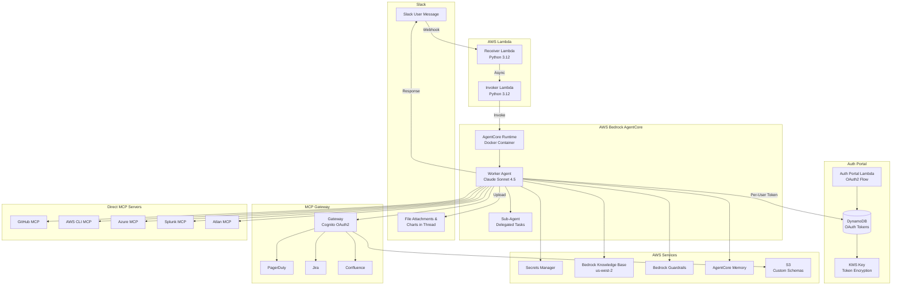
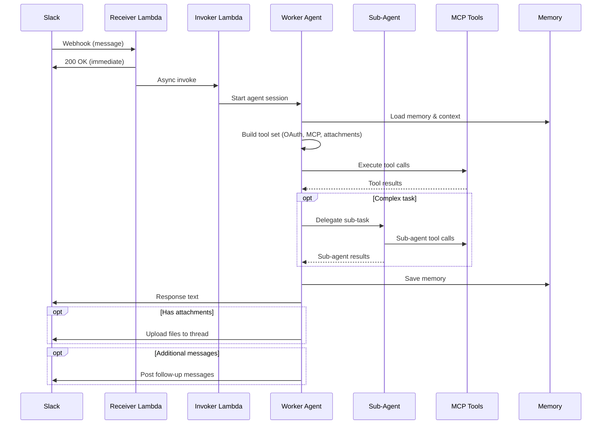
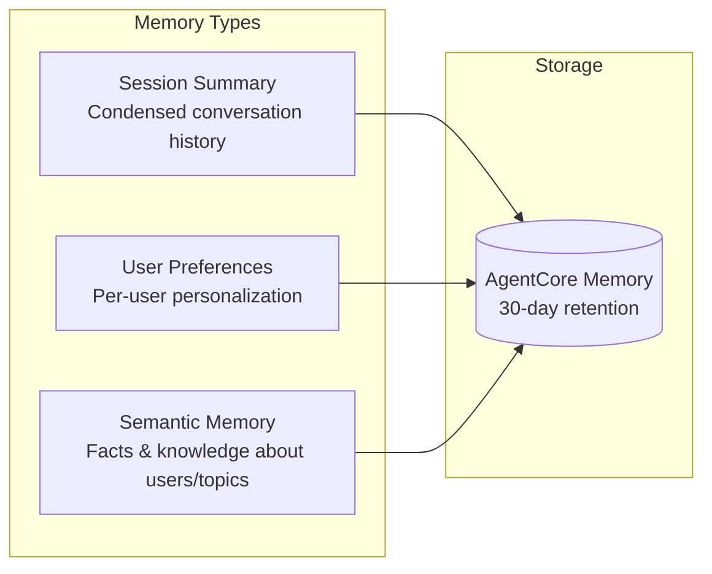

# AgentCore Agentic Slack Bot

A GenAI Slack bot powered by AWS Bedrock AgentCore and Anthropic's Claude. The bot receives messages via Slack webhooks and provides intelligent responses using AI with access to multiple enterprise tools through MCP (Model Context Protocol) gateways, per-user OAuth integrations, sub-agent delegation, and persistent memory.

## Features

- **AI-Powered Responses**: Uses Claude Sonnet 4.5 via AWS Bedrock for intelligent, context-aware responses
- **Multi-Tool Integration**: Connects to GitHub, Jira, Confluence, PagerDuty, AWS, Azure, Splunk, and Atlan via MCP
- **Per-User OAuth**: Individual users authenticate with Atlassian via an OAuth portal, enabling scoped Jira/Confluence access per user
- **Conversation Memory**: Persists user preferences, conversation summaries, and semantic knowledge across sessions
- **Knowledge Base Integration**: Queries internal knowledge bases for organization-specific information
- **File Attachments**: Generates and uploads files (charts, exports, reports) directly to Slack threads
- **Sub-Agent Delegation**: Spawns focused sub-agents for complex multi-step tasks
- **Chart Generation**: Creates charts and graphs with matplotlib, uploaded as Slack attachments
- **Content Guardrails**: Applies AWS Bedrock Guardrails with contextual block enrichment for safe, appropriate responses
- **Slack Threading**: Maintains conversation context within Slack threads with randomized loading messages

## Architecture Overview



### Components

| Component | Purpose |
|-----------|---------|
| **Receiver Lambda** | Receives Slack webhooks, validates signatures, triggers async processing |
| **Invoker Lambda** | Invokes AgentCore runtime with isolated IAM permissions |
| **AgentCore Runtime** | Containerized AI agent with Claude, MCP tools, and memory |
| **MCP Gateway** | Unified OAuth2-authenticated gateway for PagerDuty, Jira, and Confluence |
| **Auth Portal** | OAuth2 flow for per-user Atlassian authentication with encrypted token storage |
| **Sub-Agent** | Delegated agent for complex multi-step tasks requiring focused execution |

### Request Flow



## Prerequisites

- AWS Account with Bedrock access enabled
- Terraform >= 1.9.8
- Docker with buildx (for ARM64 builds)
- Slack App with Bot Token and Signing Secret
- API credentials for integrated services (GitHub, Atlassian, etc.)
- Atlassian OAuth app (for per-user authentication)

## Quick Start

### 1. Clone and Configure

```bash
git clone https://github.com/YOUR_ORG/AgentCore_AgenticSlackBot.git
cd AgentCore_AgenticSlackBot

# Copy example config and customize
cp data/tf-aws-vera-prod-ue1.tfvars data/my-environment.tfvars
```

### 2. Update Configuration

Edit your tfvars file with your environment settings:

```hcl
# Account Configuration
account_name       = "prod"
account_short_code = "prd"
region_short_code  = "ue1"
environment        = "prd"

# Bot Configuration
bot_name          = "Vera"
knowledge_base_id = "YOUR_KB_ID"
guardrails_id     = "YOUR_GUARDRAIL_ID"
secret_name       = "path/to/SECRET"
slack_bot_id      = "BXXXXXXXXXX"
slack_bot_user_id = "UXXXXXXXXXX"

# Runtime Configuration
log_level    = "INFO"
idle_timeout = 900
max_lifetime = 28800
```

### 3. Create Secrets

Create a secret in AWS Secrets Manager with the required credentials:

```json
{
  "SLACK_BOT_TOKEN": "xoxb-...",
  "SLACK_SIGNING_SECRET": "...",
  "GITHUB_TOKEN": "ghp_...",
  "ATLASSIAN_REFRESH_TOKEN": "...",
  "ATLASSIAN_CLIENT_ID": "...",
  "PAGERDUTY_API_KEY": "...",
  "SPLUNK_TOKEN": "...",
  "AZURE_TENANT_ID": "...",
  "AZURE_CLIENT_ID": "...",
  "AZURE_CLIENT_SECRET": "...",
  "GATEWAY_CLIENT_SECRET": "placeholder"
}
```

### 4. Deploy

```bash
terraform init
terraform plan -var-file=data/my-environment.tfvars
terraform apply -var-file=data/my-environment.tfvars
```

### 5. Post-Deployment

After deployment, update the `GATEWAY_CLIENT_SECRET` with the actual Cognito client secret:

```bash
# Get Cognito client secret
aws cognito-idp describe-user-pool-client \
  --user-pool-id <POOL_ID> --client-id <CLIENT_ID> --region us-east-1 \
  --query 'UserPoolClient.ClientSecret' --output text

# Update secret in Secrets Manager with the real value
```

See `POST_DEPLOY_CHECKLIST.md` for detailed post-deployment steps.

## Repository Structure

```
.
├── auth_portal/                # OAuth auth portal module
│   ├── src/
│   │   ├── auth_portal.py          # OAuth callback handler
│   │   └── portal_html.py          # Portal UI templates
│   └── *.tf                        # Portal infrastructure
├── data/                       # Terraform tfvars per environment
├── gateway/                    # MCP Gateway (Cognito + targets)
│   ├── custom_schemas/             # OpenAPI schemas for Jira/Confluence
│   ├── gateway.tf                  # Gateway core config
│   ├── gateway_target_atlassian.tf # Jira & Confluence targets
│   ├── gateway_target_pagerduty.tf # PagerDuty target
│   └── schemas.tf                  # S3 bucket for custom schemas
├── receiver/                   # Slack webhook receiver Lambda
├── invoker/                    # AgentCore invocation Lambda
├── worker/                     # AgentCore runtime container
│   ├── Dockerfile
│   ├── src/
│   │   ├── worker_agentcore.py          # Main entrypoint
│   │   ├── worker_agent.py              # Agent execution & tool setup
│   │   ├── worker_conversation.py       # Conversation orchestration
│   │   ├── worker_inputs.py             # System prompt & configuration
│   │   ├── worker_oauth.py              # Per-user OAuth token management
│   │   ├── worker_atlassian_auth_tool.py    # Atlassian auth tool
│   │   ├── worker_atlassian_rest_tools.py   # Atlassian REST API tools
│   │   ├── worker_attachment_tool.py    # File attachment tool
│   │   ├── worker_sub_agent_tool.py     # Sub-agent delegation tool
│   │   ├── worker_memory_tools.py       # Memory management tools
│   │   ├── worker_mcp_client_gateway.py # MCP gateway client
│   │   ├── worker_mcp_client_github.py  # GitHub MCP client
│   │   ├── worker_mcp_client_atlan.py   # Atlan data catalog client
│   │   ├── worker_mcp_client_aws_cli.py # AWS CLI MCP client
│   │   ├── worker_mcp_client_azure.py   # Azure MCP client
│   │   ├── worker_mcp_client_splunk.py  # Splunk MCP client
│   │   ├── worker_slack.py              # Slack API interactions
│   │   ├── worker_aws.py               # AWS helpers & guardrail enrichment
│   │   └── worker_errors.py            # Error handling & context overflow
│   └── *.tf                    # Runtime infrastructure
├── scripts/                    # Log reading utilities
├── dynamodb_oauth.tf           # DynamoDB table for OAuth tokens
├── kms_oauth.tf                # KMS key for token encryption
├── memory.tf                   # AgentCore Memory
├── bedrock_guardrail.tf        # Content guardrails
├── ecr.tf                      # Container registry
└── main.tf                     # Root module
```

## MCP Integrations

The bot integrates with multiple MCP servers for tool access:

| MCP Server | Purpose | Mode |
|------------|---------|------|
| **Gateway — PagerDuty** | Incident management, on-call schedules | Via gateway |
| **Gateway — Jira** | Issues, projects, sprints, JQL queries | Via gateway |
| **Gateway — Confluence** | Pages, spaces, search | Via gateway |
| **GitHub MCP** | Repositories, issues, PRs, commits | Direct |
| **Atlan MCP** | Data catalog, asset discovery, lineage | Direct |
| **Azure MCP** | Azure resources, VMs, storage | Direct |
| **AWS CLI MCP** | AWS services via CLI | Direct |
| **Splunk MCP** | Log search and monitoring | Direct |

### Atlassian Tools (Per-User OAuth)

In addition to MCP gateway access, the bot provides direct Atlassian REST tools that use per-user OAuth tokens:

| Tool | Purpose |
|------|---------|
| **Atlassian Auth Tool** | Prompts users to authenticate via the OAuth portal |
| **Atlassian REST Tools** | Direct Jira/Confluence API calls with user's own permissions |
| **Jira Tool Filter** | Curated Jira operations via gateway |
| **Confluence Tool Filter** | Curated Confluence operations via gateway |

### Custom Tools

| Tool | Purpose |
|------|---------|
| **File Attachment** | Upload generated files (charts, CSVs, reports) to Slack threads |
| **Sub-Agent Delegation** | Spawn focused sub-agents for complex multi-step tasks |
| **Chart Generation** | Create matplotlib charts and upload as attachments |
| **Memory Tools** | Read/write persistent user preferences and knowledge |

## Memory System

The bot uses AgentCore Memory for persistent context across conversations:



- **Session Summary**: Condensed conversation summaries retained across sessions
- **User Preferences**: Personalization (e.g., preferred formats, default projects) per user
- **Semantic Memory**: Facts and knowledge about users, topics, and organizational context

Memory is retained for 30 days by default (configurable).

## Per-User OAuth

The bot supports per-user Atlassian authentication, allowing each user to connect their own Atlassian account:

1. User asks the bot to perform a Jira/Confluence action requiring authentication
2. Bot provides a link to the **Auth Portal** (hosted on Lambda)
3. User completes the OAuth2 flow with Atlassian
4. Tokens are encrypted with **KMS** and stored in **DynamoDB**
5. Subsequent requests use the user's own token for scoped access

This enables operations like creating Jira issues, editing Confluence pages, and managing JSM service requests under the user's own identity.

## Regional Architecture

| Region | Resources |
|--------|-----------|
| **us-east-1** | Runtime, Memory, Guardrails, Lambdas, ECR, Gateway, Auth Portal, DynamoDB, KMS |
| **us-west-2** | Knowledge Base only |

## Customization

### System Prompt

Edit `worker/src/worker_inputs.py` to customize the bot's personality, instructions, and behavior. The system prompt includes sections for:
- Core identity and behavioral guidelines
- Tool-specific instructions (Atlassian, GitHub, Splunk, Atlan)
- File attachment and chart generation guidance
- Sub-agent delegation rules
- Ticketing and support workflows

### MCP Tools

Add or remove MCP integrations in `worker/src/worker_agent.py`. Each MCP client is modular and can be enabled/disabled independently. Tool filters in `worker_gateway_tools_*.py` control which gateway operations are exposed.

### Guardrails

Configure content filtering in `bedrock_guardrail.tf` to match your organization's policies. Guardrail block responses are enriched with contextual guidance via `worker_aws.py`.

### OAuth Portal

Customize the auth portal UI in `auth_portal/src/portal_html.py` and the OAuth callback logic in `auth_portal/src/auth_portal.py`.

## Troubleshooting

| Issue | Solution |
|-------|----------|
| Bot not responding | Check Lambda logs in CloudWatch (`scripts/read_logs.sh`) |
| Gateway auth failures | Verify `GATEWAY_CLIENT_SECRET` matches Cognito |
| OAuth portal errors | Check auth portal logs (`scripts/read_portal_logs.sh`) |
| Per-user token issues | Verify DynamoDB table and KMS key permissions |
| Memory errors | Ensure session/actor IDs match AWS regex patterns |
| Guardrail blocks | Review guardrail config; check enrichment in `worker_aws.py` |
| Context overflow | Agent auto-retries; check `worker_errors.py` for thresholds |

## Contributing

Contributions are welcome! Please:

1. Fork the repository
2. Create a feature branch
3. Make your changes
4. Submit a pull request

## License

MIT License - see [LICENSE](LICENSE) file for details.
