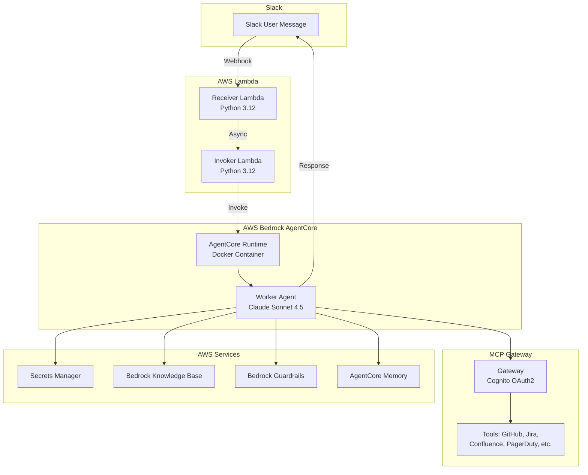

# AgentCore Agentic Slack Bot

A GenAI Slack bot powered by AWS Bedrock AgentCore and Anthropic's Claude. The bot receives messages via Slack webhooks and provides intelligent responses using AI with access to multiple enterprise tools through MCP (Model Context Protocol) gateways.

## Features

- **AI-Powered Responses**: Uses Claude Sonnet 4.5 via AWS Bedrock for intelligent, context-aware responses
- **Multi-Tool Integration**: Connects to GitHub, Jira, Confluence, PagerDuty, AWS, Azure, and Splunk via MCP
- **Conversation Memory**: Persists user preferences, conversation summaries, and semantic knowledge across sessions
- **Knowledge Base Integration**: Queries internal knowledge bases for organization-specific information
- **Content Guardrails**: Applies AWS Bedrock Guardrails for safe, appropriate responses
- **Slack Threading**: Maintains conversation context within Slack threads

## Architecture Overview



### Components

| Component | Purpose |
|-----------|---------|
| **Receiver Lambda** | Receives Slack webhooks, validates signatures, triggers async processing |
| **Invoker Lambda** | Invokes AgentCore runtime with isolated IAM permissions |
| **AgentCore Runtime** | Containerized AI agent with Claude, MCP tools, and memory |
| **MCP Gateway** | Unified OAuth2-authenticated gateway for enterprise tool access |

## Prerequisites

- AWS Account with Bedrock access enabled
- Terraform >= 1.9.8
- Docker with buildx (for ARM64 builds)
- Slack App with Bot Token and Signing Secret
- API credentials for integrated services (GitHub, Atlassian, etc.)

## Quick Start

### 1. Clone and Configure

```bash
git clone https://github.com/YOUR_ORG/AgentCore_AgenticSlackBot.git
cd AgentCore_AgenticSlackBot

# Copy example config and customize
cp data/tf-aws-vera-prod-ue1.tfvars data/my-environment.tfvars
```

### 2. Update Configuration

Edit your tfvars file with your environment settings:

```hcl
# Account Configuration
account_name       = "prod"
account_short_code = "prd"
region_short_code  = "ue1"
environment        = "prd"

# Bot Configuration
bot_name          = "Vera"
knowledge_base_id = "YOUR_KB_ID"
guardrails_id     = "YOUR_GUARDRAIL_ID"
secret_name       = "path/to/SECRET"

# Runtime Configuration
log_level    = "INFO"
idle_timeout = 900
max_lifetime = 28800
```

### 3. Create Secrets

Create a secret in AWS Secrets Manager with the required credentials:

```json
{
  "SLACK_BOT_TOKEN": "xoxb-...",
  "SLACK_SIGNING_SECRET": "...",
  "GITHUB_TOKEN": "ghp_...",
  "ATLASSIAN_REFRESH_TOKEN": "...",
  "ATLASSIAN_CLIENT_ID": "...",
  "PAGERDUTY_API_KEY": "...",
  "SPLUNK_TOKEN": "...",
  "AZURE_TENANT_ID": "...",
  "AZURE_CLIENT_ID": "...",
  "AZURE_CLIENT_SECRET": "...",
  "GATEWAY_CLIENT_SECRET": "placeholder"
}
```

### 4. Deploy

```bash
terraform init
terraform plan -var-file=data/my-environment.tfvars
terraform apply -var-file=data/my-environment.tfvars
```

### 5. Post-Deployment

After deployment, update the `GATEWAY_CLIENT_SECRET` with the actual Cognito client secret:

```bash
# Get Cognito client secret
aws cognito-idp describe-user-pool-client \
  --user-pool-id <POOL_ID> --client-id <CLIENT_ID> --region us-east-1 \
  --query 'UserPoolClient.ClientSecret' --output text

# Update secret in Secrets Manager with the real value
```

See `POST_DEPLOY_CHECKLIST.md` for detailed post-deployment steps.

## Repository Structure

```
.
├── data/                    # Terraform tfvars per environment
├── gateway/                 # MCP Gateway (Cognito + targets)
├── receiver/                # Slack webhook receiver Lambda
├── invoker/                 # AgentCore invocation Lambda
├── worker/                  # AgentCore runtime container
│   ├── Dockerfile
│   ├── src/
│   │   ├── worker_agentcore.py      # Main entrypoint
│   │   ├── worker_agent.py          # Agent execution
│   │   ├── worker_mcp_client_*.py   # MCP integrations
│   │   └── ...
│   └── *.tf                 # Runtime infrastructure
├── memory.tf                # AgentCore Memory
├── ecr.tf                   # Container registry
└── main.tf                  # Root module
```

## MCP Integrations

The bot integrates with multiple MCP servers for tool access:

| MCP Server | Purpose | Mode |
|------------|---------|------|
| **Gateway MCP** | Unified access to gateway-registered providers | Read-only |
| **GitHub MCP** | Repositories, issues, PRs, commits | Read-only |
| **Atlassian MCP** | Jira issues, Confluence pages | Read-only |
| **Azure MCP** | Azure resources, VMs, storage | Read-only |
| **AWS CLI MCP** | AWS services via CLI | Read-only |
| **Splunk MCP** | Log search and monitoring | Read-only |

## Memory System

The bot uses AgentCore Memory for persistent context:

- **Session Summary**: Condensed conversation summaries
- **User Preferences**: Personalization across conversations
- **Semantic Memory**: Facts and knowledge about users/topics

Memory is retained for 30 days by default (configurable).

## Regional Architecture

| Region | Resources |
|--------|-----------|
| **us-east-1** | Runtime, Memory, Guardrails, Lambdas, ECR, Gateway |
| **us-west-2** | Knowledge Base only |

## Customization

### System Prompt

Edit `worker/src/worker_inputs.py` to customize the bot's personality, instructions, and behavior.

### MCP Tools

Add or remove MCP integrations in `worker/src/worker_agent.py`. Each MCP client is modular and can be enabled/disabled independently.

### Guardrails

Configure content filtering in `bedrock_guardrail.tf` to match your organization's policies.

## Troubleshooting

| Issue | Solution |
|-------|----------|
| Bot not responding | Check Lambda logs in CloudWatch |
| Gateway auth failures | Verify `GATEWAY_CLIENT_SECRET` matches Cognito |
| Memory errors | Ensure session/actor IDs match AWS regex patterns |
| Guardrail errors | Verify `guardrails_id` in tfvars matches AWS Console |

## Contributing

Contributions are welcome! Please:

1. Fork the repository
2. Create a feature branch
3. Make your changes
4. Submit a pull request

## License

MIT License - see [LICENSE](LICENSE) file for details.
